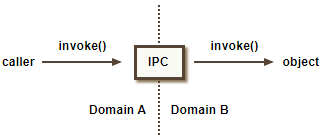
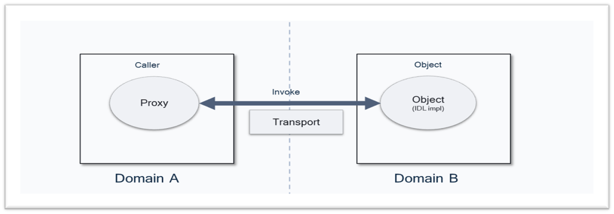

# MINK IPC

## Introduction
**MINK** ('Mink is Not a Kernel') is a capability-based security framework.

At the core of MINK stands MINK IPC: a synchronous message passing facility based on the Object-Capability model, designed to facilitate secure communication between different domains. It enables code in one domain to invoke objects in another domain by passing unforgeable object references as input or output arguments. This inter-domain communication is implemented on top of various transport mechanisms such as the TEE subsytem's object invoke IOCTL, Sockets and even SMC calls.

<p align="center">

</p>

**MINK** as a security paradigm combines objects (encapsulation) with capabilities (authority) to enforce access control. [Qualcomm® Trusted Execution Environment (QTEE)](https://docs.qualcomm.com/bundle/publicresource/topics/80-70015-11/qualcomm-trusted-execution-environment.html) ecosystem is built on top of this paradigm to provide a robust framework for accessing security services. QTEE Kernel and Qualcomm® Trusted Virtual Machine (QTVM) Platform use MINK-based architecture ensuring that modules/Trusted Applications access only the minimal information and resources necessary for their function, thereby enhancing overall system security.

This project aims to demonstrate how MINK IPC can serve as a generic IPC framework and facilitate communication between multiple execution environments.

## MINK IDL and Transport

<p align="center">

</p>

**Mink IDL** is used to describe programming interfaces that can be used to communicate across security domain boundaries. Once an interface is described in a IDL source file, the [Mink IDL compiler](https://github.com/quic/mink-idl-compiler), can be used to generate C language header files. These files define types and proxy functions that implement method invocation on top of Mink's `Object_invoke` IPC mechanism, shielding clients and implementations from the details of calling invoke directly.

**Mink transport** serves as communication channel to convey `Object_invoke` across domain boundaries. It provides
-	Methods for sending and receiving invocation requests.
-	Methods for marshaling data using a protocol understood by both end points.

Qualcomm® products use MINK IPC to communicate with services running on other execution environments like QTEE or QTVM.

## Mink Transport for QTEE

This repository contains libraries that implement, and clients that utilize, a Mink-IPC interface for communication with the QTEE via the QCOM-TEE driver registered with the Linux TEE subsystem.

Read more about MINK-IPC [here](docs/mink-object.md).

Read more about QCOMTEE [here](https://github.com/quic/quic-teec).

## Build Instructions
```
git clone https://github.com/quic/minkipc.git
cd minkipc
mkdir build
cd build
cmake .. -DCMAKE_TOOLCHAIN_FILE=CMakeToolchain.txt -DBUILD_UNITTEST=ON && cmake --build . --target install --config Release
```
In order to build this package, you require QCBOR and QCOMTEE. These are not available using the standard Ubuntu repository. If you do not have them installed on your machine, you can fetch, build and install them from below mentioned locations:

1. QCBOR [repository](https://github.com/laurencelundblade/QCBOR). Use `-DQCBOR_DIR_HINT=/path/to/installed/dir` to specify the QCBOR dependency.

2. QCOMTEE [repository](https://github.com/quic/quic-teec). Use `-DQCOMTEE_DIR_HINT=/path/to/installed/dir` to specify the QCOMTEE dependency.

You can optionally specify the path for installation of the `minkipc` package, via `-DCMAKE_INSTALL_PREFIX:PATH=/path/to/minkipc/install`.

## Tests
List of available tests for each module are available in the module's README file.

## Contributions

Thanks for your interest in contributing to MinkIPC! Please read our [Contributions Page](CONTRIBUTING.md) for more information on contributing features or bug fixes. We look forward to your participation!

## License

**MinkIPC** Project is licensed under the [BSD-3-clause License](https://spdx.org/licenses/BSD-3-Clause.html). See [LICENSE.txt](LICENSE.txt) for the full license text.

