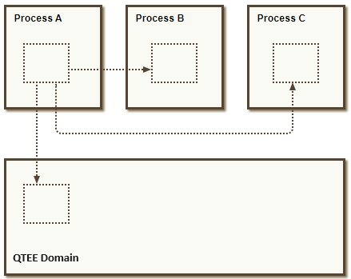

## Mink IPC
A Mink-based system allows software executing in different **domains** to communicate with each other through Mink IPC via Mink-objects. For example, an application running in Linux user-space domain can communicate with a trusted application running in the Qualcomm Trusted Execution Environment (QTEE) domain by invoking a reference to a 'Mink-object' received from QTEE. A 'Mink-object' is represented by an instance of an 'Object' which consists of a function pointer and a context value.

## Architecture of a Mink-based system

Communication between domains is enabled by Mink's IPC primitive, which can be described briefly as an object capability based synchronous message passing facility. It allows code executing in one domain to invoke objects running in other domains.

<p align="center">

</p>

A domain in where software executes. Thus, domains can contain Linux user-space processes, trusted applications, and some may contain drivers or other system services.

Each domain has an associated **address space** that dictates it's memory access rights. An address space associates virtual addresses (the addresses used by code executing in the process) with physical addresses and access rights (read, write, execute).

Each domain also has an **object table**, which is analogous to a file descriptor table in POSIX-based operating systems. The object table is an array of objects that the domain is allowed to invoke. When the domain invokes an external object (one that resides in another domain), it identifies the object by its index in the object table.

## The Generic Mink-object

A Mink object consists of a function pointer and a context value.

```
struct Object {
  ObjectInvoke invoke;
  ObjectCxt context;
};
```

The context value is a `void *`:

```
typedef void *ObjectCxt;
```

The function pointer has the following signature:

```
typedef int32_t (*ObjectInvoke)(
  ObjectCxt cxt,
  ObjectOp op,
  ObjectArg *args,
  ObjectCounts counts);
```

When an object is invoked, its invoke function is called, and its context value is passed as its first argument. The Object_invoke macro encapsulate this:

```
static inline int Object_invoke(Object o, ObjectOp op, ObjectArg *args, ObjectCounts k)
{
  return o.invoke(o.context, op, args, k);
}
```

Context values typically hold pointers to heap nodes that have been allocated to hold the object's state. The interpretation of the context value is at the discretion of the implementer of the object. When objects have no mutable state, the context value might point to static objects, or the it could be ignored entirely.

### ObjectOp

Each ObjectOp value contains two values stored in bit fields: modifier bits and the method.

Modifier bits are reserved for transport-level semantics. Callers other than transports should leave these bits zero. Modifier bits are the higher-order bits, so callers can simply pass a method ID as the operation code.

Callees must extract the method ID using `ObjectOp_methodID(op)`.

Method IDs from `0` to `ObjectOp_METHOD_USERMAX` and from `ObjectOp_LOCAL` to `ObjectOp_LOCAL + ObjectOp_METHOD_USERMAX` (inclusive) are “user” values: objects can choose any meanings for them. Other values are reserved for use by object.h. Currently two such methods IDs are defined: `Object_OP_release` and `Object_OP_retain`.

Objects must safely ignore reserved methods they do not support and return `Object_ERROR_INVALID`.

### ObjectArg

The args parameter is an array containing the arguments, which can describe buffers (contiguous byte arrays in memory) or objects.
```
typedef union ObjectArg {
  ObjectBuf b;
  Object o;
} ObjectArg;
```

Each argument, whether buffer or object, is classified as either an input argument or an output argument. Arguments are ordered according to their classification: input buffers are followed by output buffers, then input objects, and finally output objects.

### ObjectCounts

The `ObjectCounts k` parameter specifies the number of each kind of argument. It is constructed with the following macro:

`ObjectCounts_pack(nBuffersIn, nBuffersOut, nObjectsIn, nObjectsOut)`

For example, `ObjectCounts_pack(2, 0, 0, 1)` indicates that `args[0]` and `args[1]` contain `ObjectBuf` values used as inputs, and that `args[2]` holds an `ObjectArg` value used as an output.

### Buffer Arguments

Each buffer is described by a pointer and a size. Buffers are sequences of bytes that are logically passed by value.

The size field of each `ObjectBuf` structure must be set by the caller to the amount of memory allocated. The contents of input buffers must be initialized by the caller. When returning `Object_OK`, a callee must set the size field of each output buffer to the number of bytes (starting at `offset 0`) that have been filled with data. In error cases, the output data is not marshaled and the caller must ignore the size value.

### Object Arguments

Object arguments are simply Object values — the same values used to invoke objects, plus a special value, `Object_NULL`.

The caller must initialize all input objects to valid objects or `Object_NULL`. The callee must initialize all output objects, on success, to valid objects or `Object_NULL`. In the event of an error return value, output objects must be ignored by the caller.

### Reference Counting

Each Object value (aside from `Object_NULL`) constitutes a reference to some object. It is the responsibility of the programmer to keep track of references held by the software. The retain and release methods increment and decrement an internal reference count in the object.

Each object returned from invoke — as a `non-NULL` output object argument returned from a sucessful invoke — constitutes a new reference held by the caller, which must be eventually released.

When an object is invoked, the input object arguments are available for its use during the invocation. The callee may copy the object argument out and holds it beyond the duration of that call, but if so it must call retain on the object to account for the newly created reference, and then call release when that reference is destroyed.

### Example

In this example, `args` and `k` describe invocation arguments consisting of two input buffers, one output buffer, one input object, and one output object.

<p align="center">

</p>

## Mink-IPC mechanism

When the object and its client reside in different domains, Mink's Inter-Process Communication (IPC) mechanism comes into play.

In these cases, the Object structures held by the client are **proxy** objects that are responsible for delivering the invocation to the **target** object.

<p align="center">

</p>

The role of IPC in Mink is to convey `Object_invoke` across domain boundaries, so the the `Object_invoke` function serves as a specification for Mink IPC. Some of the salient features of Mink's IPC are as follows:

-   **Synchronous Operation**
    Invoke is like POSIX system calls in that in addition to accepting inputs it can provide outputs. The invoke call will block the caller until the operation has completed.
-   **Explicit Parameters** 
    The caller of `Object_invoke` explicitly declares all parameters and indicates whether they are input parameters or output parameters. Listing a buffer as an input (or output) parameter indicates that the invoked object should be allowed to read (or write) the contents of that memory during the invocation.  
    **Discontiguous Buffers** 
    Input and output data is can reside in multiple discontiguous buffers. Each buffer is a sequence of bytes located anywhere in the address space of the process.
-   **Caller-allocated Output Buffers**  
    The caller of invoke provides memory to hold response data. The invoked object may fill only a portion of the buffer, but it may not return more data than was allocated by the caller.
-   **Object-based Addressing**  
    Messages are directed to individual object references received from another domain.
-   **Object-based Access Control**  
    The Mink-lPC mechanism allows each domain to invoke only the objects that have been granted to it.
-   **Object Parameters**
    Objects can be passed as inputs or outputs in an invocation. This is the mechanism by which addresses are communicated and by which access is granted. A domain can pass an object to another domain only when it holds a legitimate reference to the object.
-   **Errors**  
    An integer return value indicates error or success conditions.  
    When an object reference cannot be invoked — for example, the domain in which it resides has terminated — the QTEE kernel will return one of a number of pre-defined error codes. In the case of a successfully delivered invocation, this will hold the value returned by the invoked capability.

## Mink Adaptor, QCOMTEE and QTEE interactions

1.  The Mink Adaptor library executes in the context of a client process and serves as a "User Invoke Gateway" running in user mode atop Linux.  
    For outbound invocations, this gateway provides a function that proxies `Object_invoke` calls. Client code invokes QTEE objects by calling `Object_invoke` either directly or through an [IDL-generated stub](https://github.com/quic/mink-idl-compiler). When an Object structure identifies a QTEE object, its invoke member points to the outbound invoke function provided by the gateway. This function then makes a request of the kernel driver.  
    For inbound invocations, the gateway provides code that waits for incoming invocations and dispatches the calls to local objects. This code also makes use of the kernel driver.  
    The interaction between this gateway and the driver constitute the “Driver API”.
2.  The QCOMTEE Driver accepts requests from the client process and constructs an SMC command record that will be sent to QTEE.  The driver receives virtual addresses provided by the client process. When provided buffers are contiguous, it will make use of those buffers in-place. Otherwise, it will allocate from a contiguous memory pool for the duration of the invocation. Objects (both the target object and input object parameters) are identified using integer handles. These are values previously returned from SMC calls, or `0`, which identifies the **“primordial”** object exposed to both Linux and QTEE.
3.  The QTEE Invoke Router performs Object and Memory validation, translation of handles, and "locking" of resources to ensure that the translated values remain valid for the duration of the invocation. Particularly, the object handles are translated to `Object` structures that are to be called on a service thread within QTEE.

<p align="center">

</p>

## Mink-objects supported by Mink Adaptor

The Mink Adaptor library supports the following Mink objects for its user-space clients:

### Root Environment Object

A Root Environment Object is a type of Remote Object that allows invocation to the **"primordial"** Object within QTEE. This is the first object which the user-space clients acquire from the Mink Adaptor Gateway to initiate communication with entities within QTEE.

### Callback Objects

These objects are forwarded from the Linux environment to QTEE to allow domains within QTEE to hold remote references to them. Entities in the QTEE domain (e.g. Trusted Applications) can utilize these remote references to invoke object functionality implemented by entities in the Linux domain (e.g. Linux user-space Applications).

### Memory Objects

A Memory Object represents contiguous page-aligned memory shared with QTEE. Clients can write into this memory and share the Memory Object with QTEE via `Object_invoke`.

